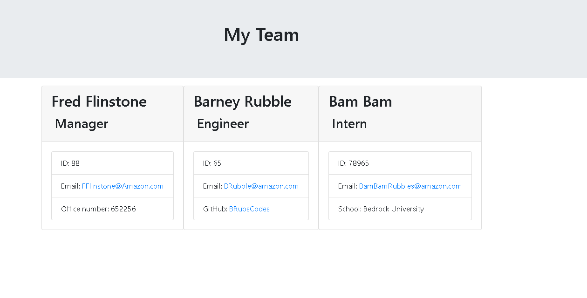

# Software-Engineering-Team-Generator


## Description

The Software Engineering Team Generator lets you enter you enter the details of the people in your team so that you have single goto spot to verify thier details. Currently it supports a manager an engineer and interns more can be added simply templating the code. You can learn more by watching the video <a href = "https://www.youtube.com/watch?v=ElrCoqf96No"> here</a>

     
  - [Description](#description)
  - [Installation](#installation)
  - [Usage](#usage)
  - [Credits](#credits)
  - [License](#license)
  - [Contributing](#contributing)
  - [Tests](#tests)
  - [Questions](#Questions)

## Installation

You need Node.JS, to perform Test Driven Development you'll need jest. You also need inquirer. Clone this project and run npm install i, npm install jest and npm install jest. Use git bash or VS code andt type node app.js to run the Softeware Engineering Team Generator.

## Usage

The SETG app can be used to construct a HTML file that will display the team members you enter into it. Below you can see the final result.


## About the code.
Test driven development was utilized to create the calsses. In our case we have a Employee class that is then inherited and extended in subsequent Manager, Engineer and Intern classes. TDD was accomplished utilizeing jest. 

```
test("Can set id via constructor argument", () => {
  const testValue = 100;
  const e = new Employee("Foo", testValue);
  expect(e.id).toBe(testValue);
});
```

For the inquire menus I was able to utilize recursion to create a presistient prompt system.

```
function init() {
    inquirer.prompt(mainMenu).then((answer) => {
        const choice = answer.MainMenu;
        console.log(choice + " is type of " + typeof (choice));
        if (choice.includes("Create_Team")) {
            teamMaker();
        } else {
            console.log("Exiting....")
        }
    });
}

```
notice we call teamMaker() this will call a diffrent menu that looks as such:
```
function teamMaker() {
    inquirer.prompt(addEmployees).then((answer) => {
        const choice = answer.addEdit;
        switch(choice){
            case "Add a Manager":
                addManager();
                break;
            case "Add a Engineer":
                addEngineer();
                break;
            case "Add a Intern":
                addIntern();
                break;
            case "Render a Team List":
                renderTeam();
                break;
            case "Go Back to Main Menu":
                init();     
                break;
            default:
                init();
                break;           
        }
    });
}
```
As you can see each function calls a new menu each which allows the user to navigate to diffrent menus. 

## Questions

### Please Contact: joejoe909 Email: joseph_a_f@hotmail.com